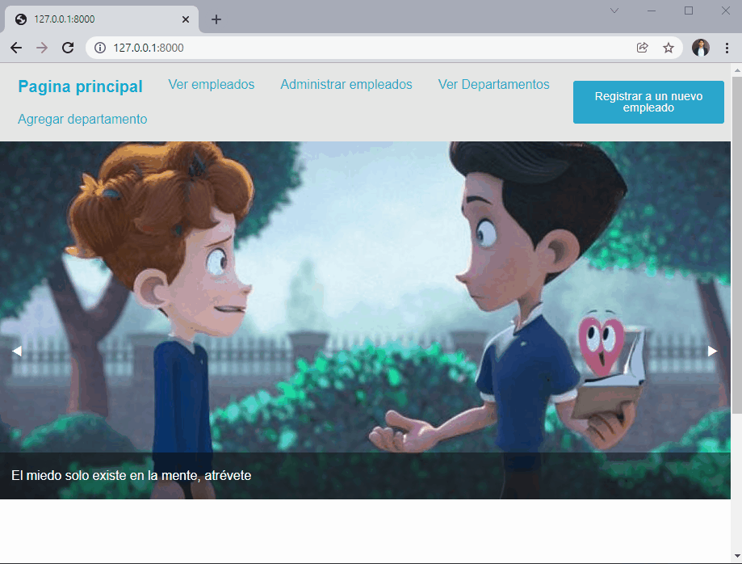

# **Registro y control de empleados con Django**
#### **Proyecto desarrollado en el curso de UDEMY cuyo nombre es: Django y Django rest framework de básico a profesional de:Cristhian Santa Cruz Programador Full Stack**

A continuación adjunto el certificado que obtuve tras finalizar el grandioso curso de 41 horas de video.

<div align="center">

</div>


<hr>

## **Menu**
<hr>

* [1) Descripccion del proyecto](#1-descripccion-del-proyecto)
    * [1.1) Breve visualizacion del proyecto](#11-breve-visualizacion-del-proyecto)
    * [1.2) Conocimientos puestos en practica](#12-conocimientos-puestos-en-practica)

* [2) Funcionamiento del proyecto](#2-funcionamiento-del-proyecto)
    * [2.1) Cambiar las imagenes que aparecen en la pagina principal](#21-cambiar-las-imagenes-que-aparecen-en-la-pagina-principal)
    * [2.2) Ver los empleados registrados](#22-ver-los-empleados-registrados)

    * [2.3) Editar o eliminar empleados](#23-editar-o-eliminar-empleados)
    * [2.4) Ver los departamentos y empleados que tiene cada departamento](#24-ver-los-departamentos-y-empleados-que-tiene-cada-departamento)
    * [2.5) Agregar un departamento](#25-agregar-un-departamento)
    * [2.6) Agregar un empleado](#26-agregar-un-empleado)

    
* [3) Posibles errores](#3-posibles-errores)


<hr>

## **1) Descripccion del proyecto**

<div class="myWrapper" markdown="1" align="center">

[Regresar al menu principal](#menu)

</div>

El proyecto tal y como dice la documentación, sirve para registrar, eliminar y ver empleados, tambien es capaz registrar los departamentos a los que ellos pertenecen, es importante mencionar que ha este proyecto le hice pequeñas modificaciones, una de ellas fue que ahora desde el administrador se pueden cargar las imagenes que se visualizan de portada de la pagina de inicio del sitio web, otra modificacion que hice fue que ahora cuando se registre un DEPARTAMENTO tambien se pedira la imagen del avatar del ADMINISTRADOR del departamento asi como sus habilidades, otra modificacion que realice fue que cuando se cambia de apartado el nombre del apartado en el que se encuentra se resalta en letras grandes, y una de las ultimas cosas que agregue fue mejorar la privacidad de los datos sensibles como la contraseña y nombre del usuario que tiene acceso a la base de datos, asi como el nombre de la base de datos.


### **1.1) Breve visualizacion del proyecto**

<div class="myWrapper" markdown="1" align="center">

[Regresar al menu principal](#menu)
</div>


<div align="center">

</div>


### **1.2) Conocimientos puestos en practica**

<div class="myWrapper" markdown="1" align="center">

[Regresar al menu principal](#menu)
</div>


* Una buena organización de codigo en proyectos de Django
* El uso de diferentes vistas tales como: TemplateView,ListView,DetailView,UpdateView,DeleteView
* El uso de  formularios en Django
* La creación de diferentes Apps asi como tambien la creación de modelos.
* El uso de: PostgreSQL como sistema de gestión de bases de datos 
* El uso de: Foundation como framework de interfaz de usuario
* El almacenamiento de contenido media.
* El constante uso del sitio de administración de Django


## **2) Funcionamiento del proyecto**
<div class="myWrapper" markdown="1" align="center">

[Regresar al menu principal](#menu)
</div>


### **2.1) Cambiar las imagenes que aparecen en la pagina principal**
<div class="myWrapper" markdown="1" align="center">

[Regresar al menu principal](#menu)
</div>


Para cambiar las imagenes que aparecen en la pagina principal del sitio web, se debera ir al 
sitio de administración de Django e inciar sesion con una cuenta de super usuario, si no se cuenta con ninguna entonces debera crearse una.Una vez dentro debera seleccionarse el modelo  **Home** y agregar una nueva instancia de este, al hacerlo se pedira una imagen y una frase celebre las cuales una vez adjuntadas, el sitio web las mostrar en la pagina principal en la pagina principal.


<div align="center">

</div>


### **2.2) Ver los empleados registrados**
<div class="myWrapper" markdown="1" align="center">

[Regresar al menu principal](#menu)
</div>


Para ver los empleados registrados hay diferentes maneras de conseguirlo:

* Desde la pagina principal:

<div align="center">

</div>

* En el encabezado de la pagina al dar clic sobre: **Ver empleados**

<div align="center">

</div>


### **2.3) Editar o eliminar empleados**
<div class="myWrapper" markdown="1" align="center">

[Regresar al menu principal](#menu)
</div>

En el encabezado de la pagina al dar clic sobre: **Administrar empleados**

* Para editar los datos de un empleado se hace lo siguiente:

<div align="center">

</div>

* Para eliminar a un empleado se hace lo iguiente


<div align="center">

</div>

### **2.4) Ver los departamentos y empleados que tiene cada departamento**
<div class="myWrapper" markdown="1" align="center">

[Regresar al menu principal](#menu)
</div>

En el encabezado de la pagina al dar clic sobre: **Ver departamentos**

<div align="center">

</div>


### **2.5) Agregar un departamento**
<div class="myWrapper" markdown="1" align="center">

[Regresar al menu principal](#menu)
</div>

En el encabezado de la pagina al dar clic sobre: **Agregar departamento**
y poner los datos que se piden

<div align="center">

</div>

### **2.6) Agregar un empleado**
<div class="myWrapper" markdown="1" align="center">

[Regresar al menu principal](#menu)
</div>


En el encabezado de la pagina al dar clic sobre: **Registrar un nuevo empleado** y poner los datoss que se piden

<div align="center">

</div>


## **3) Posibles errores**
<div class="myWrapper" markdown="1" align="center">

[Regresar al menu principal](#menu)
</div>


Al descargar el proyecto en cada aplicacion que tiene deberia existir una carpeta con el nombre de **"migrations"** y dentro de dicha carpeta deberia existir un archivo con el nombre **"__init\__.py"**, sin embargo debido a que elimine el contenido de todas las carpetas **"migrations"** no se subio lo mencionado anteriormente.Como deberia verse una vez descargado seria asi, de lo contrario django marcara error.

```
├── proyecto1
│   ├── aplications
│   │   ├── departamento
│   |   |   └── migrations
│   |   |       └── __init__.py
│   │   ├── home
│   |   |   └── migrations
│   |   |       └── __init__.py
│   │   ├── persona
│   |   |   └── migrations
│   |   |       └── __init__.py
```


